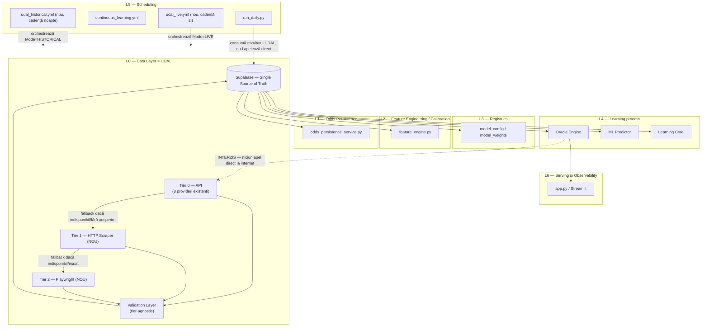
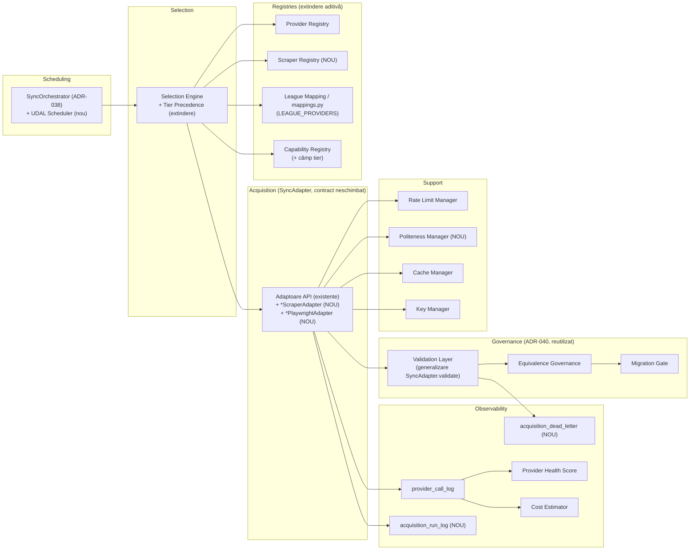
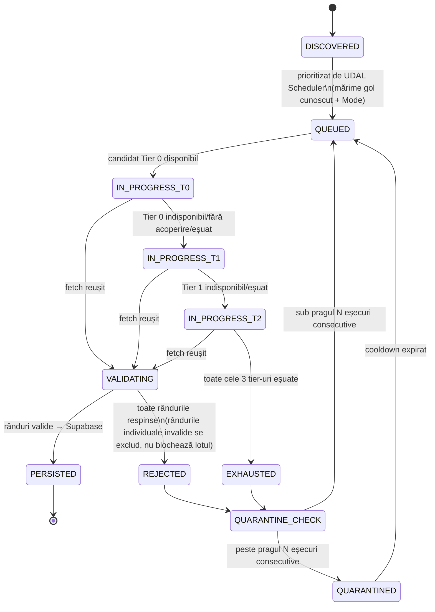
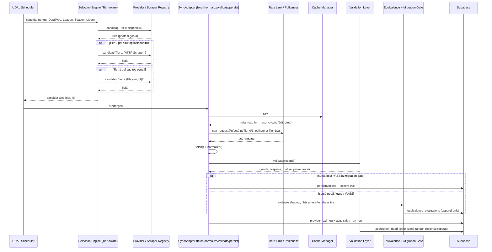

# UDAL Architecture Specification v1.0 — Universal Data Acquisition Layer

**Companion**: `docs/00_GOVERNANCE/ADR-042-universal-data-acquisition-layer.md`
(decizia). Acest document e specificația tehnică — toate diagramele,
design-ul per componentă, planul de migrare. **Document de proiectare —
nimic din el nu e implementat.** Niciun tabel, migrare, cod sau flag nu a
fost creat odată cu acest document.

**Status**: PROPUS, în așteptarea aprobării proprietarului produsului.

**Data**: 2026-07-28.

---

## 0.a Vision [ADAUGAT 2026-07-28, după Faza 1.5]

> UDAL nu mai este doar un scraper. UDAL devine: **Universal Football
> Knowledge Acquisition Layer.** Scopul este să poată integra orice
> sursă relevantă pentru Football Oracle.

Decizie explicită a proprietarului produsului — acronimul (UDAL) și tot
codul existent rămân neschimbate; extinderea e de scop pe termen lung.
Clasificarea de surse (Primary/Secondary/Premium) și „Future Providers"
(Transfermarkt, FBref) trăiesc în `docs/06_UDAL/UDAL_SOURCE_CLASSIFICATION.md`,
nu duplicate aici.

## 0. Poziționare — ce e UDAL, ce nu e

UDAL **nu e un sistem nou, paralel cu Sync Layer-ul** — e Sync Layer-ul
existent (`provider_registry.py`, `provider_capabilities.py`,
`provider_selector.py`, `sync_adapter.py`, `sync_orchestrator.py`,
mecanismul shadow/gate ADR-040) ridicat formal la rang de subsistem major
și **extins pe axa tier-ului de achiziție**: sub tier-ul API existent
(Tier 0), UDAL adaugă Tier 1 (HTTP Scraper) și Tier 2 (Playwright), plus
un motor formal de backfill istoric (5 sezoane) și o politică explicită de
scheduling zi/noapte. Argumentul pentru „extindere, nu sistem nou" e
detaliat în ADR-042 §1 — nu se repetă aici.

UDAL rămâne strict în **L0 — Data Layer**, conform layering-ului deja
definit în CLAUDE.md. Nicio componentă UDAL nu depinde „în sus" de Oracle
Engine, Learning Core sau Streamlit. Oracle Engine/ML/Learning Core nu
depind niciodată direct de UDAL — depind exclusiv de Supabase, exact ca
azi.

---

## 1. Diagrama de Arhitectură

**Regulă structurală, nu doar convenție**: singura săgeată care iese din
L0 e către Supabase. Niciun modul din L1-L6 nu are, azi sau după UDAL, un
import către `requests`/`playwright` pentru un provider extern — verificat
prin `architecture-review` (skill deja existent, declanșat automat la
orice import nou între module).

---

## 2. Diagrama de Componente

---

## 3. Graful de Dependințe

Scop: să arate explicit ce e **reutilizat** (nicio duplicare) și ce e
**strict nou**, per componentă.

```mermaid
flowchart TD
    UDAL_SCHED["UDAL Scheduler (NOU)"] --> SyncOrchestrator["sync_orchestrator.py\n(ADR-038, neatins)"]
    UDAL_TIER["Tier Precedence (extindere)"] --> provider_selector["provider_selector.py\n(neatins, doar consumat)"]
    UDAL_TIER --> sync_provider_manager["sync_provider_manager.py\n(extins aditiv)"]
    ScraperRegistry["scraper_registry.py (NOU)"] --> provider_capabilities["provider_capabilities.py\n(+ câmp tier, aditiv)"]
    ScraperAdapter["*ScraperAdapter (NOU)"] --> sync_adapter["sync_adapter.py\n(contract SyncAdapter, neschimbat)"]
    PlaywrightAdapter["*PlaywrightAdapter (NOU)"] --> sync_adapter
    PolitenessManager["politeness_manager.py (NOU)"] --> rate_limit_manager["rate_limit_manager.py\n(tipar reutilizat, nu moștenit direct)"]
    UDALValidation["udal_validation.py (NOU)"] --> sync_adapter
    UDALValidation --> mappings["mappings.py\n(LEAGUE_PROVIDERS, neatins)"]
    UDALShadow["entity=udal_* (config nouă)"] --> equivalence_governance["equivalence_governance.py\n(neatins, entity-agnostic deja)"]
    UDALShadow --> migration_gate["migration_gate.py\n(neatins, entity-agnostic deja)"]
    ScraperAdapter --> request_manager["request_manager.py"]
    ScraperAdapter --> cache_manager["cache_manager.py"]
    ScraperAdapter --> key_manager["key_manager.py"]
    ScraperAdapter --> provider_call_classification["provider_call_classification.py\n(+ valori noi failure_reason)"]
```

**Citire**: fiecare nod „(NOU)" e cod care nu există azi. Fiecare săgeată
către un nod fără „(NOU)" e reutilizare directă, fără al doilea motor —
exact tiparul impus de ADR-041.

---

## 4. Mașina de Stări — ciclul de viață al unei ținte de achiziție

O **Acquisition Target** = `(DataType, League, Season, Mode)` —
generalizarea directă a tuplului `(domain, league, intent)` deja folosit
de `sync_provider_manager.choose_provider()`, cu `Season` adăugat (necesar
pentru backfill pe 5 sezoane) și `intent` redenumit `Mode ∈ {LIVE,
HISTORICAL}` (aliniat la cadența zi/noapte, §7).

**Notă de proiectare, nu presupunere**: tranziția `IN_PROGRESS_T0 →
IN_PROGRESS_T1` nu înseamnă „Tier 0 a răspuns cu date proaste" — înseamnă
strict una din: (a) niciun provider Tier 0 nu declară acoperire pentru
acest `(DataType, League)` în `LEAGUE_PROVIDERS`/Capability Registry, (b)
toți candidații Tier 0 disponibili au eșuat validarea de disponibilitate
(cotă epuizată, `is_available()=False`), sau (c) fetch-ul a eșuat după
epuizarea retry-urilor proprii tier-ului. Escaladarea nu e niciodată o
alegere de calitate — Selection Engine-ul nu compară niciodată un scor
Tier 1 cu un scor Tier 0.

---

## 5. Fluxul de Date complet

---

## 6. Ownership per componentă

| Componentă | Owner (scriitor unic) | Statut |
|---|---|---|
| `provider_registry.py` | Provider Registry (existent) | Neatins |
| `provider_capabilities.py` (+ câmp `tier`) | Capability Registry (existent) | Extindere aditivă |
| `scraper_registry.py` | Scraper Registry (nou) | NOU |
| `scraper_selector_registry` (hartă selectori, versionată) | Scraper Registry | NOU |
| `sync_provider_manager.py` (+ precedență tier) | Selection Engine, al doilea consumator (ADR-041) | Extindere aditivă |
| `*ScraperAdapter` (per sursă) | Adaptorul propriu, contract `SyncAdapter` | NOU |
| `*PlaywrightAdapter` (per sursă) | Adaptorul propriu, contract `SyncAdapter` | NOU |
| `politeness_manager.py` | Politeness Manager (nou) | NOU |
| `udal_validation.py` | Validation Layer (nou, generic) | NOU |
| `acquisition_run_log` | UDAL Scheduler (unic scriitor per rulare) | NOU |
| `acquisition_dead_letter` | Validation Layer (unic scriitor) | NOU |
| `equivalence_governance.py` (entity=`udal_*`) | Equivalence Governance (existent) | Neatins, consumat cu entity nou |
| `migration_gate.py` (gate_key=`udal_*`) | Migration Gate (existent) | Neatins, consumat cu gate_key nou |
| `match_history` / alte tabele canonice | **neschimbat** — owner rămâne cel din ADR-036 (`run_backfill`, `sync_results`, etc.) | UDAL scrie DOAR prin adaptoarele existente care au deja ownership, nu ocolește ADR-036 |

**Regulă explicită, ADR-036 rămâne intactă**: UDAL nu introduce un nou
scriitor pentru coloane care au deja owner (ex. `FEATURE_COLUMNS`). Un
`*ScraperAdapter` care produce statistici de meci pentru Romania SuperLiga
scrie prin **același** punct unic de scriere pe care `run_backfill` îl
deține azi pentru `FEATURE_COLUMNS` — UDAL e o sursă nouă de INPUT pentru
acel scriitor, nu un scriitor concurent. Dacă acest lucru se dovedește
imposibil tehnic la implementare (de ex. cadență diferită), rezolvarea
cere un ADR dedicat de realocare a ownership-ului, nu o scriere tăcută
paralelă.

---

## 7. Provider Registry design (extindere)

`provider_registry.py`/`provider_capabilities.py` capătă un câmp nou,
aditiv, pe fiecare intrare: `tier: AcquisitionTier` (enum nou,
`API | HTTP_SCRAPER | PLAYWRIGHT`), implicit `API` pentru toți cei 8
provideri existenți — **zero schimbare de comportament pentru codul de
azi**. `Selection Engine`-ul capătă o etapă de filtrare STRICTĂ înaintea
scorului ponderat existent: candidații se grupează întâi pe tier, iar
grupul de tier inferior devine vizibil doar dacă grupul de tier superior
e gol după filtrele de disponibilitate/acoperire deja existente
(`is_available`, `supports(data_type)`, `league_state`). Scorul ponderat
pe 6 componente (`SelectionWeights`) continuă să decidă DOAR între
candidați din același tier — nu se schimbă formula, doar domeniul pe care
se aplică.

## 8. Scraper Registry design

Modul nou (`scraper_registry.py`), oglindă structurală a
`provider_capabilities.py`, dar cu metadate specifice tier-urilor 1/2 —
deliberat NU forțat în același `dataclass` ca `ProviderCapability`
(metadatele sunt prea diferite: URL template vs. bază API, selectori vs.
endpoint-uri, politețe vs. cotă). Câmpuri per intrare:

- `scraper_id` (string, unic)
- `tier` (`HTTP_SCRAPER` | `PLAYWRIGHT`)
- `target_url_template` — parametrizat `{league}`/`{season}`/`{date}`,
  niciodată un URL literal per ligă în cod (cerința explicită „zero cod
  hardcodat pe competiții")
- `data_types_supported: set[DataType]` (reutilizează enum-ul existent din
  `provider_capabilities.py`, aditiv — nu un enum paralel)
- `selector_map_ref` — referință la o hartă de selectori **externalizată**
  (tabelă `scraper_selector_registry`, versionată: `version`,
  `updated_at`, `updated_by`), nu constantă Python — condiție necesară
  pentru ca detectarea de drift (viitoare) să aibă ceva de comparat
- `politeness_policy_ref` — crawl-delay, concurență maximă, respectare
  `robots.txt` (obligatorie, verificată la fiecare rulare, nu doar la
  înregistrare)
- `tos_reviewed: bool`, `tos_reviewed_by`, `tos_reviewed_at` — **câmp
  obligatoriu, blocant** — un scraper cu `tos_reviewed=False` nu rulează
  niciodată, nici măcar în shadow mode (vezi §16, problema legală)
- `requires_browser: bool` (derivat din tier, explicit pentru claritate)

## 9. Validation Layer design

Generalizarea contractului `SyncAdapter.validate()` (deja „nu aruncă
niciodată pentru un rând individual invalid — îl exclude", regulă
existentă) într-un modul comun (`udal_validation.py`), aplicat DUPĂ
`normalize()`, INDIFERENT de tier — un rând produs de Playwright trece
prin exact aceeași validare ca unul produs de API. Trei clase de verificare:

1. **Validare de schemă** — tip, interval, câmpuri obligatorii per
   `DataType` (reutilizează convenția `REQUIRED_FIELD_ALIASES`/
   `KNOWN_OPTIONAL_FIELD_ALIASES` deja folosită în `sync/sources/kaggle.py`).
2. **Consistență inter-câmp** — non-negative, sumă plauzibilă, dată
   coerentă cu sezonul.
3. **Coliziune de cheie naturală** — reutilizează exact tiparul
   `idx_match_history_natural_key_canonical` (verificare înainte de orice
   scriere, nu presupunere).

**Proveniență obligatorie pe fiecare rând**, extinzând tiparul
`field_provenance` JSONB deja folosit în `scheduled_fixtures` (migrarea
023) la nivel UDAL general: `source_tier`, `source_id` (provider sau
scraper), `fetched_at`, `confidence` (`CONFIRMED_API | SCRAPED_VERIFIED |
SCRAPED_UNVERIFIED` — trei stări, nu boolean, per regula ADR-001 „stare
necunoscută rămâne necunoscută, nu se aproximează"). Un rând fără
proveniență completă e respins de Validation Layer, indiferent de restul
conținutului — regulă strictă, nu opțională, pentru trasabilitate completă
(North Star #9).

## 10. Scheduling design — cadență zi/noapte

Generalizează `Mode ∈ {LIVE, HISTORICAL}` din tuplul Acquisition Target
(§4) într-o politică explicită de scheduling, nu doar o etichetă:

| | LIVE (zi) | HISTORICAL (noapte) |
|---|---|---|
| Frecvență | Minute (precedent: `lineup_sync.yml`, 15 min) | O rulare/noapte |
| Tier preferat | Aproape exclusiv Tier 0 — latența Tier 2 (lansare browser) e incompatibilă cu prospețimea live | Tier 0 → 1 → 2, toate active |
| Prioritizare | Meciurile din următoarele 7 zile (fereastra deja folosită de `get_matches_for_week`) | Goluri de acoperire cunoscute, cel mai mare gol întâi (reutilizează `provider_cost_estimator`/`FIELD_CAPABILITY_MATRIX` ca sursă de prioritate) |
| Buget politețe | Minimal — puține ținte, cotă API de obicei suficientă | Bugetul principal de scraping — rulează în afara orelor de trafic live, reduce coliziunea |
| Workflow nou propus | `udal_live.yml` (cron frecvent, `workflow_dispatch`) | `udal_historical.yml` (`cron: "0 1 * * *"`, înainte de `daily.yml` la 03:00) |

**Decizie explicită de cuplare slabă, nu editare a `run_daily.py`**:
`udal_historical.yml` rulează independent, programat suficient de devreme
(01:00 UTC) încât să se termine înainte de pasul `backfill_features` din
`run_daily.py` (03:00 UTC). `run_daily.py` capătă un singur control nou,
minimal, aditiv: o verificare de prospețime („UDAL a rulat cu succes în
ultimele N ore?") la începutul pipeline-ului, care doar loghează un
avertisment dacă nu — **nu blochează, nu editează ordinea existentă de
pași**. Alternativa respinsă explicit: inserarea UDAL ca pas nou în
`PIPELINE_STEPS` cu `depends_on` — respinsă pentru că ar crește suprafața
de risc a unui pipeline deja critic, exact ce interdicția „Nu modifica
Oracle Engine" cere să se evite indirect.

## 11. Observability design

Reutilizează integral tiparul `provider_call_log` →
`provider_health_score.py` → `provider_cost_estimator.py`, extins cu:

- Valori noi în `failure_reason` (extensie aditivă a vocabularului deschis
  din `provider_call_classification.py`, care documentează explicit că nu
  e un enum închis): `selector_not_found` (semnal de drift), `render_timeout`
  (specific Playwright), `blocked` (anti-bot/CAPTCHA detectat), `robots_disallowed`.
- Tabelă nouă, la nivel de LOT nu de apel HTTP individual:
  `acquisition_run_log` — un rând per rulare de target (`target`, `tier`,
  `records_fetched`, `records_validated`, `records_persisted`,
  `records_rejected`, `duration_ms`, `drift_flags_raised`).
- Loc dedicat, proiectat dar neimplementat, pentru diagnostice viitoare
  (AI-readiness): `acquisition_run_log.diagnostic_ref` → un bucket
  Supabase Storage `udal-diagnostics/`, populat DOAR la eșec de validare
  sau `selector_not_found`, DOAR pentru Tier 1/2 (capturi HTML/screenshot
  — cost prohibitiv pentru Tier 0, care oricum nu are „selectori" de
  verificat).

## 12. Failure Recovery design

- **Circuit breaker per (sursă, tier)** — extensia directă a stării
  per-provider deja ținute de `RateLimitManager`, generalizată la orice
  sursă UDAL (API, scraper sau Playwright).
- **Escaladare de tier la eșec, niciodată inversă** — vezi mașina de stări
  §4.
- **Retry cu backoff** — reutilizează tiparul deja confirmat
  (`urllib3.Retry`, `backoff_factor=0.5`, retry pe 429/500/502/503/504,
  `soccerfootballinfo_client.py`), cu backoff mai mare pentru Tier 1/2
  (politețe) și un plafon STRICT de reîncercări pentru Tier 2 (cost
  Playwright).
- **Dead letter, nu ștergere silențioasă** — rândurile respinse repetat de
  Validation Layer se scriu în `acquisition_dead_letter` (proiectat, nu
  implementat), pentru trasabilitate completă (North Star #9) — nu se
  pierd fără urmă.
- **Carantină per țintă** — o țintă `(DataType, League, Season, Mode)` cu
  N eșecuri consecutive pe TOATE tier-urile intră în `QUARANTINED` cu un
  cooldown, ca să nu consume buget de rulare la fiecare ciclu pentru o
  țintă structural nefuncțională.

## 13. Feature Flags necesare

Toate urmează exact tiparul existent (`model_config` JSON blob, funcție
dedicată `is_x_enabled()`, implicit `False`, per North Star #3):

| Flag | Implicit | Scop |
|---|---|---|
| `udal_enabled` | `False` | Întrerupător general, master |
| `udal_tier_http_scraper_enabled` | `False` | Activează Tier 1 |
| `udal_tier_playwright_enabled` | `False` | Activează Tier 2 — separat de Tier 1, risc/cost mai mare |
| `udal_historical_backfill_enabled` | `False` | Activează motorul de backfill 5 sezoane |
| `udal_live_acquisition_enabled` | `False` | Activează cadența zi |
| `udal_shadow_mode_enabled` | `True` (când master pornește) | Orice sursă nouă rulează în shadow înainte de scriere live — implicit ON, nu OFF, pentru siguranță |
| `udal_source_<scraper_id>_enabled` | `False` | Control granular per sursă, activare individuală |

## 14. Testing Strategy

- **Fără rețea live în suita automată** — regulă deja impusă de skill-ul
  `test-coverage-guard`; testele pentru `*ScraperAdapter`/`*PlaywrightAdapter`
  rulează exclusiv pe fixture-uri HTML salvate, nu pe site-uri live.
- **Teste de contract** — o suită parametrizată (pytest) care rulează
  aceleași asserții (`fetch/normalize/validate/persist` respectă
  `SyncAdapter`) pe ORICE adaptor înregistrat, indiferent de tier —
  garantează consistență comportamentală, nu doar per-adaptor.
- **Teste golden-snapshot** — o ieșire cunoscută-corectă salvată per
  fixture HTML; dacă un drift de selector rupe parsarea, testul eșuează
  în CI înainte ca detectarea de drift din producție (viitoare) să
  apuce să reacționeze — prima linie de apărare, nu singura.
- **Shadow obligatoriu înainte de live** — reutilizează exact
  `equivalence_governance.py`/`migration_gate.py` cu `entity="udal_<sursă>"`,
  identic tiparului `entity="scheduled_fixtures"` din ADR-040.
- **POC izolat pentru verificare live one-off** — tiparul deja stabilit
  în acest proiect (`scripts/_<nume>_poc_temp.py` +
  `.github/workflows/<nume>_poc_temp.yml`, șters după verificare) rămâne
  singura cale de verificare live manuală, niciodată în suita automată.

## 15. Migration Plan pe faze

Fiecare fază e reversibilă, gated de flag implicit `False`, și nu ține de
faza următoare pentru valoare — exact disciplina ADR-040.

**Faza 0 — Fundație structurală, zero date noi**
ADR-042 aprobat → tabele proiectate (`scraper_registry`,
`scraper_selector_registry`, `acquisition_run_log`,
`acquisition_dead_letter`) → enum `AcquisitionTier` adăugat aditiv în
`provider_capabilities.py` (toți providerii existenți capătă `tier=API`,
zero schimbare de comportament) → toate flag-urile din §13 înregistrate,
`False`. Include absorbția formală a `sync/sources/` (football-data.co.uk,
openfootball, Kaggle) — azi un al treilea tipar de achiziție, disconectat
de Provider Registry — sub același model de tier (probabil Tier 0/1
echivalent, bulk istoric), ca să nu rămână trei tipare paralele (problemă
explicită, §16.7).

**Faza 1 — Tier 1 (HTTP Scraper), o singură țintă pilot, shadow-only**
O singură țintă, aleasă din golurile deja documentate ca justificând o
sursă nouă: statistici de meci Romania SuperLiga (0% acoperire azi,
confirmat). Un singur `*ScraperAdapter`, scrie DOAR în shadow
(`entity="udal_ro_superliga_stats"`), gate GRAY până la prag de volum +
sănătate — niciodată scriere live în această fază.

**Faza 2 — Validation Layer + Observability generalizate**
Extrage din pilot componentele reutilizabile (`udal_validation.py`,
`acquisition_run_log`) ca module comune, ca fazele următoare să nu repete
pilotul, ci să se conecteze la infrastructură deja generică.

**Faza 3 — Tier 1, extindere multi-țintă**
Restul golurilor documentate (Referee/Attendance, ligi suplimentare),
câte una, fiecare cu propriul `gate_key`, prioritizate de mărimea golului
cunoscut (reutilizează `FIELD_CAPABILITY_MATRIX`).

**Faza 4 — Tier 2 (Playwright), pilot**
Abia după ce Fazele 1-3 dovedesc pipeline-ul shadow/validare/gate
funcțional end-to-end pe date reale. O singură țintă, exclusiv pentru
date randate JS pe care Tier 1 nu le poate parsa. Revizuire explicită de
cost/latență înainte de activare (§16.3) — Playwright e infrastructură
100% nouă în acest repo, fără niciun precedent.

**Faza 5 — Motor de Backfill Istoric, 5 sezoane**
Extinde `intent=BACKFILL` deja existent în `sync_provider_manager.py` +
prioritizarea SyncOrchestrator (P1-P5) la o baleiere formală pe 5 sezoane,
per `(DataType, League)`, prioritizată de mărimea golului, exclusiv
cadență noapte.

**Faza 6 — Cutover / retragerea lanțurilor statice interimare**
Doar după verdict PASS per `gate_key` (mecanism deja existent, ADR-040):
`_STATIC_FALLBACK_CHAINS` din `sync_provider_manager.py` care devin
redundante se retrag, blocate explicit de un test dedicat până la PASS —
tiparul exact `test_migration_gate_blocks_r_sync_7c.py`.

**Faza 7 — Puncte AI-readiness, proiectate azi, activate în viitor**
Detectare drift selectori (consumă versionarea din `scraper_selector_registry`),
diagnostic automat (consumă `acquisition_run_log` + `acquisition_dead_letter`),
rapoarte de reparare — **doar propuneri, niciodată reparare automată** fără
un ADR dedicat de risc, exact precedentul auto-promovare/auto-rollback
(ADR-002).

---

## 16. Probleme arhitecturale de rezolvat înainte de implementare

Documentate explicit, per cerință — nu presupuse, nu ascunse.

1. **Risc legal/ToS per țintă de scraping** — nu e o problemă pe care
   arhitectura o poate rezolva singură. Scraper Registry impune câmpul
   blocant `tos_reviewed` (§8), dar decizia efectivă — dacă o anumită
   sursă publică poate fi accesată legitim prin scraping — rămâne o
   decizie a proprietarului produsului, per sursă, înainte de Faza 1.
2. **Zero infrastructură de browser existentă azi** — singurul precedent
   de scraping din tot repo-ul e un singur `BeautifulSoup` pentru un
   tabel HTML static (`oracle_api.py::_fetch_elo_ratings()`). Playwright
   (Tier 2) e infrastructură complet nouă — cost și risc de implementare
   real, motiv explicit pentru care e programat ultimul (Faza 4), nu în
   paralel cu Tier 1.
3. **Plafonul de resurse al runner-ului standard GitHub Actions** —
   descoperire directă, din aceeași sesiune: un download de ~2GB a
   omorât de 3 ori consecutiv runner-ul standard (14GB disc total,
   parțial ocupat de toolchain), fără nicio eroare capturabilă în cod —
   procesul a fost terminat la nivel de sistem de operare. Un headless
   Chromium pe pagini JS-grele poate atinge plafoane similare de
   memorie/disc. **Recomandare explicită**: joburile Tier 2 (Playwright)
   nu ar trebui presupuse compatibile cu runner-ul standard gratuit —
   necesită fie un runner self-hosted, fie mediul de execuție curent
   (acest mediu Claude Code Remote, cu ~28GB disponibili observați direct
   în această sesiune, semnificativ mai mult decât runner-ul standard).
   Nu se presupune o soluție — se documentează explicit ca decizie
   deschisă înainte de Faza 4.
4. **Fragilitate inerentă a selectorilor HTML** — externalizarea hărții
   de selectori (§8) atenuează, nu elimină. Tier 1/2 rămân explicit
   „ultimă soluție" prin ordinul de achiziție impus — API-ul e preferat
   activ, nu doar declarat preferat.
5. **Asimetrie de încredere între date API și date scraped** — Validation
   Layer poate exprima diferența (`confidence`, §9), dar decizia despre
   CUM intră un câmp `SCRAPED_*` în `FEATURE_COLUMNS` pentru ML rămâne
   deschisă — cere propriul test de ablație, fără excepție (regula ML
   existentă, neschimbată), decis la momentul Fazei 1, nu presupus aici.
6. **Politețea e o clasă de resursă nouă, nu o cotă** — `RateLimitManager`
   modelează un NUMĂR de cereri rămase; politețea de scraping (crawl-delay,
   concurență, `robots.txt`) e despre RITM, nu volum. `politeness_manager.py`
   e proiectat ca modul soră, nu ca extensie directă a `RateLimitManager` —
   forțarea în același model ar ascunde diferența semantică.
7. **`sync/sources/` e azi un al treilea tipar de achiziție, disconectat**
   — `football_data_co_uk.py`, `openfootball.py`, `kaggle.py` nu trec prin
   Provider Registry/`SyncAdapter` deloc. Dacă UDAL nu le absoarbe formal
   (Faza 0, §15), rămân trei tipare de achiziție paralele în același
   proiect — exact fragmentarea pe care UDAL e menit s-o elimine, nu s-o
   adauge.
8. **Risc de ordine de dependințe cu `run_daily.py`** — rezolvat prin
   cuplare slabă + verificare de prospețime (§10), nu prin editarea
   pipeline-ului critic existent. Alternativa (inserare directă în
   `PIPELINE_STEPS`) a fost considerată și respinsă explicit — motivul e
   documentat, nu doar decizia.
